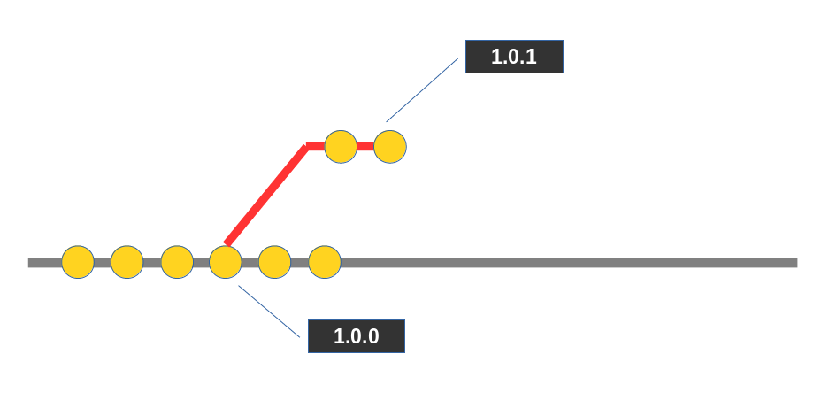
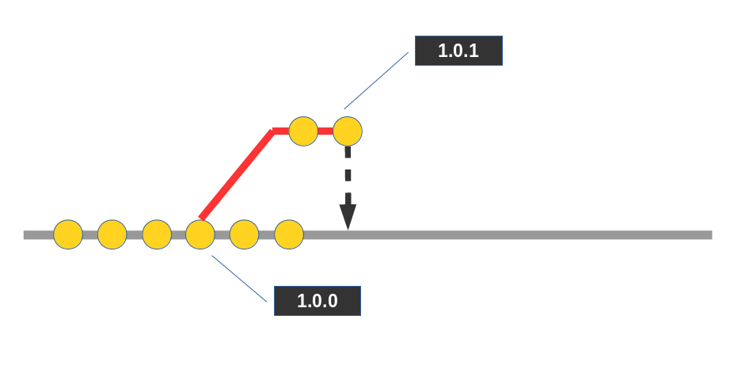

# Version control system - hotfix branch






Git:
* Create branch: ```git branch <name>```
* Switch to branch: ```git checkout <name>```
* Create and switch to new branch: ```git checkout -b <name>```
* Merged branches: ```git branch --merged```
* Not merged branches: ```git branch --no-merged```
* Remove local branch: ```git branch -d <branch>```
* Remove remote branch: ```git push origin :<branch>``` 
