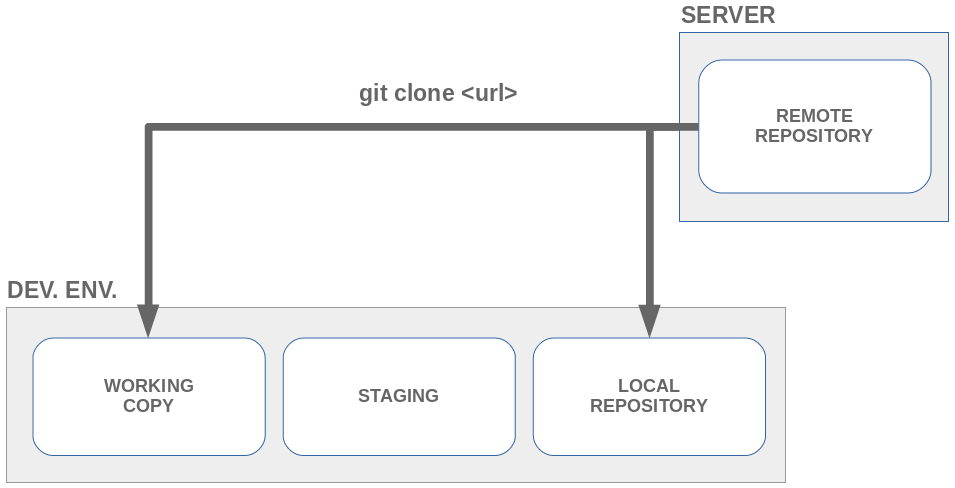
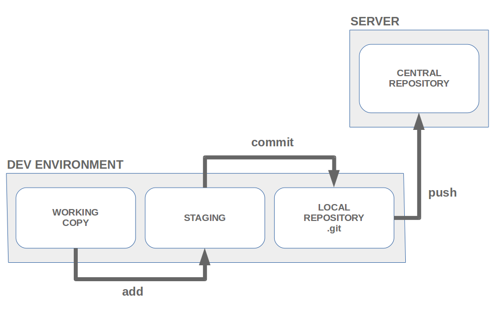
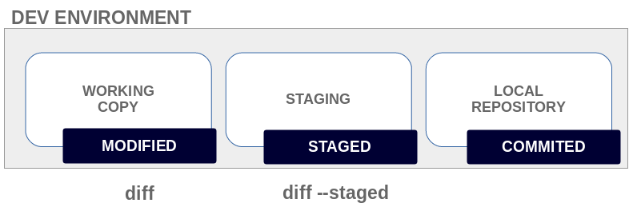
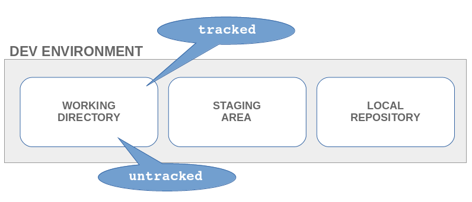
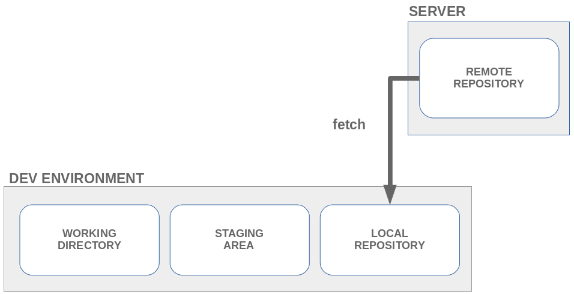
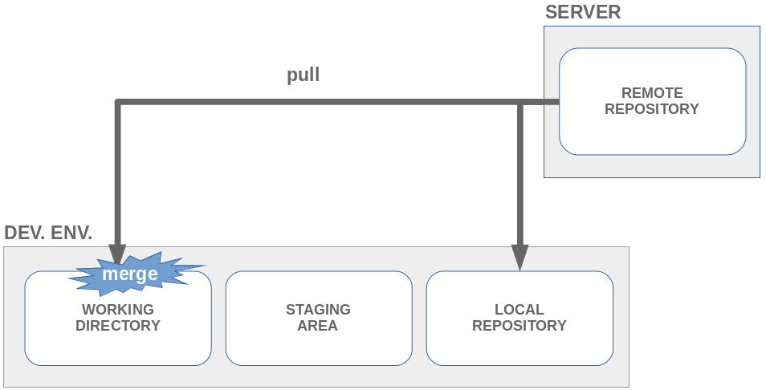
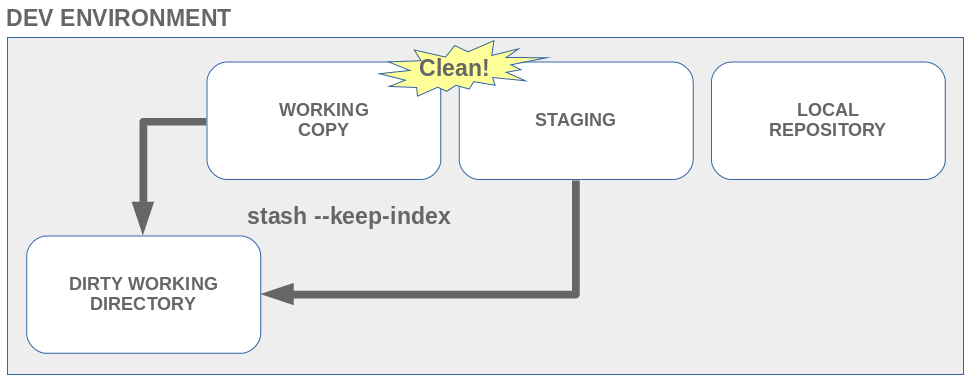
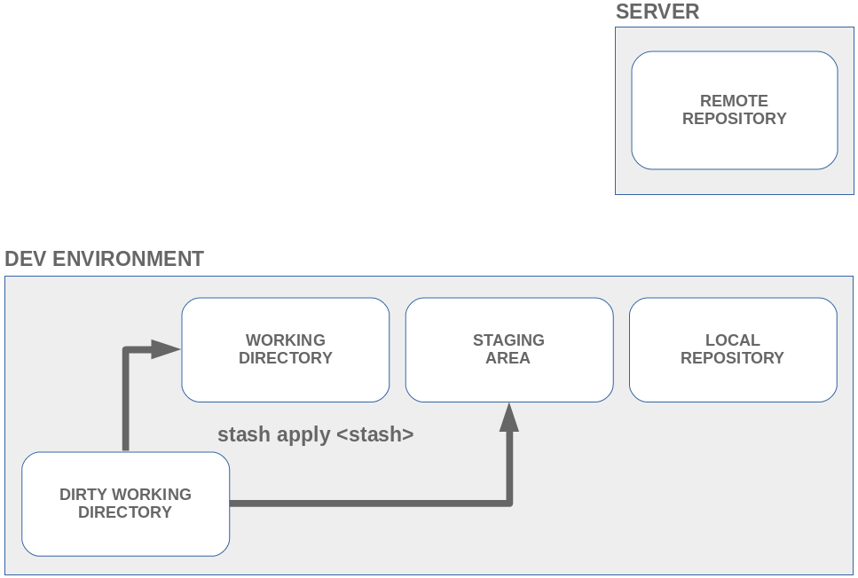
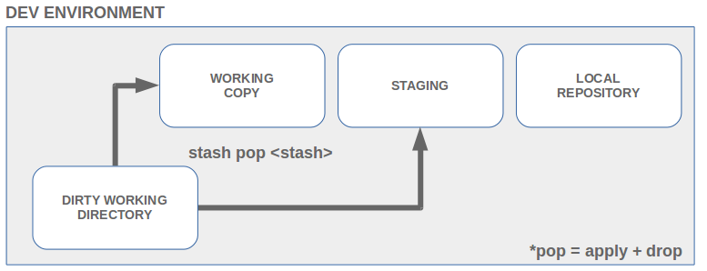

# Git

NOTE: ``` -- ``` means _no more options; the following is a file_



* Staging = index
* A _shallow_ clone with last 100 commits: ```git clone --depth 100 URL```



* Add all files: ```git add -A```
* Add only updated files (already tracked): ```git add -u```
* Add certain changes of each file: ```git add -p``` (interactive way)
* Include in last commit (not pushed) with the same comment: ```git commit -C HEAD --amend```
* Undo:
    * A change: ```git checkout -- [file]```
    * A file in staging: ```git reset HEAD -- [file]```
    * All changes and staged files (return to last commit): ```git reset --hard HEAD```
    * Last local commit (staging the changes): ```git reset --soft HEAD^```
    * A pushed commit: ```git revert <commit id>```





* Git can't track empty directories. To track them, you can add an empty file as ```.include_in_git```
* Remove all untracked files: ```git clean```





* ```git pull --rebase```: any local changes are replayed







## Status

* ```git status```
* ```git status --short```:
    * ```??```: new
    * ```A```: staged
    * ```M```: modified
    * ```_M```: mofified, not staged
    * ```M_```: modified and staged
    * ```MM```: modified and staged; modified again without staged

## Tags

Two types:
* Lightweight tags (only a name for a commit): ```git tag <name>```
* Annotated tag (they are meant for release; they contain a creation date, the tagger name and e-mail, a tagging message, and an optional GnuPG signature): ```git tag -a <name> -m <message>```

And: ```git push origin --tags``` or ```git push origin <tagname>```

## Logs

* ```git log```
* To see changes: ```git log -p```
* To see last n changes: ```git log -p -<n>```
* Statistics: ```git log --stat```
* Formats:
    * ```git log --pretty=oneline```
    * ```git log --pretty=short```
    * ```git log --pretty=full```
    * ```git log --pretty=fuller```
    * ```git log --pretty=format:"%h - %an, %ar : %s"```
* Filters (to apply several filters: ```--all-match```):
    * ```git log --since=2.weeks```
    * ```git log --since="2008-01-15"```
    * ```git log --since="2 years 1 day 3 minutes ago"```
    * ```git log --author=<author>```
    * ```git log --grep=<regex for commit message>```
    * ```git log --grep=<regex for commit message>``` -i
    * ```git log -S<changed string in commit>```
    * ```git log -- <path of modified file in commit>```

# Further investigation

```git blame <file>```

# Retrieving a lost commit 

```
git reflog
git cherry-pick <commit>
```

# Interesting links
* [Visualizing Git](https://github.com/git-school/visualizing-git)
* [Git from the Bottom Up](https://jwiegley.github.io/git-from-the-bottom-up) - thanks [@jaramir](https://github.com/jaramir)!!
